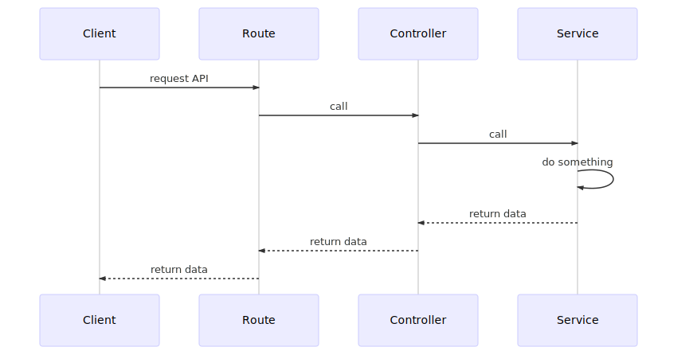
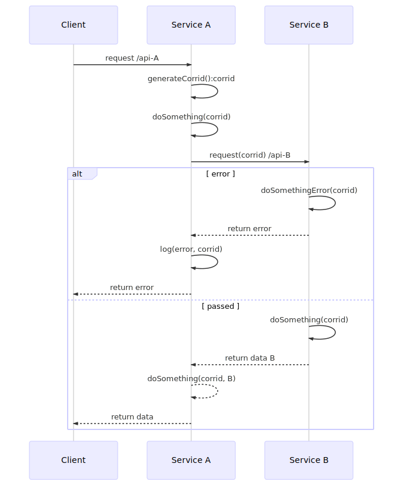
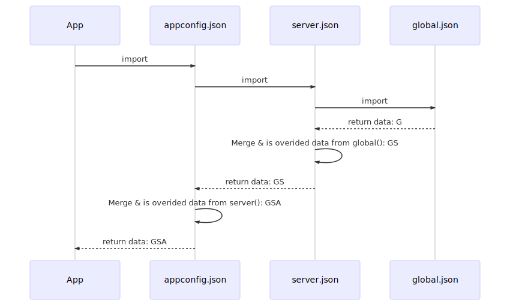

# Base Service
Base service

# Features
1. Easy to manage APIs
2. Easy to create pluign to inject into functions
3. Manage log center, support manage corr_id to manage log between services, functions
4. Combine unit test with generate DOCs into project. This make build API become professonal and 

# How to begin to develop

1. Install libraries

    ```sh
      npm install
    ```

2. Run typescript compiler & start server

    ```sh
      npm run dev
    ```

# How to deploy on production environment

1. Build project

    ```sh
      npm run build
    ```

2. After the building done, we will get ```dist``` folder , now we only go in dist folder then run

    ```sh
      npm run prod
    ```

> You can mount ```dist``` folder into docker container to run

# Project structure
```yaml
- src: # Source files
  - common: # Utility functions
  - controller:
    - http: # Contains the register routers
      index.ts: # Includes *Routes.ts which will bind on server
      *Route.ts: # Routes for each request
    *Controller.ts: # Main function handle each request in route
  - service: # Contains the logic code files
    index.ts: # Write something here which will be run once time after each start server
    *Service.ts # Business function
  AppConfig.ts: # mapped to appconfig.json
  env.development.ts: # Be loaded for development environment
  env.production.ts: # Be loaded for production environment
- docs: # Documents, Flow charts...
  - main-flow: # Includes the sequences, uml diagram for main flows
- dist: # Contains js files which are built from source code
- deploy: # Contains patch, sql migration ...
- test: # Contains unit test file
- test-perf: # Contains files which is used to test performance
appconfig.json: # Config file which is loaded by src/AppConfig.ts
DOC.md: # Document file which is generated after run unit test
Dockerfile: # Create docker container for this service
package.json: # Declare the configuration files in the field "appconfig"
```

# Main flows

1. Flow code
    
  

2. Flow error handler
    
  

3. Flow config loader

  - Default configuration is set in "appconfig" in package.json.
  - Default value is [
    "appconfig.json",
    "server.json",
    "global.json?env,oauthConfig,mongo,redis,encrypt,services,log,cors,#base"
  ]

  

# API Document
Click [here](./DOC.md) to see APIs document