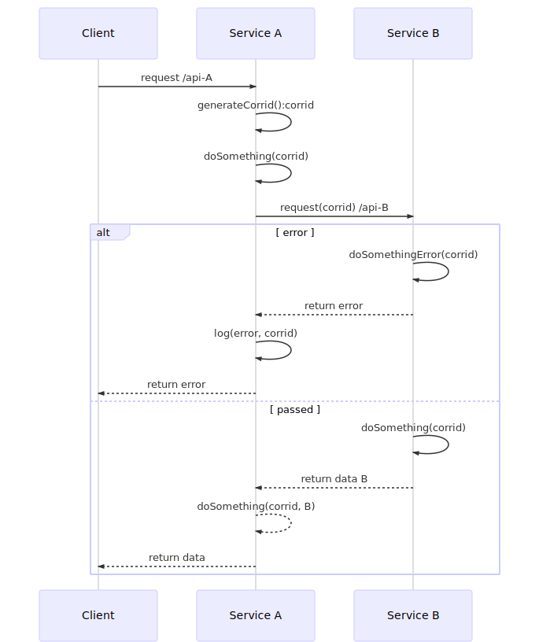

# Project Documents

## Router/Controller

```javascript
import { GET, POST, PUT, DELETE, PATCH, HEAD } from 'no6-route/lib/route'
import { BODYPARSER } from 'no6-bodyparser/lib/body'
import HttpError from 'no6-utils/lib/HttpError'
import { VALIDATOR } from 'no6-bodyparser/lib/validator'

@GET('/Hello')
static hello(ctx) {
  return 'Hello world'
}

@POST('/Hello/:name')
@VALIDATOR({
  params: {
    name: vs().string()
  },
  afterParams(params, ctx) {
    if (params.name === 'world') throw HttpError.BAD_REQUEST('Name must be not ' + params.name)
  }
})
@BODYPARSER()
static hello(ctx) {
  return `Hello ${ctx.params.name}`
}

```

## Error handling

> Default when throw error in controller, it auto catch and log it

```javascript
import * as _ from 'lodash'
import { AUTO_TRACE_ERROR, AUTO_LOG } from 'no6-log/lib/debug'
import { Context } from 'no6-server'
import { MONGO, Mongo } from 'no6-mongo'

// TODO: Auto trace log in "debug" level which is configured in appconfig.json
@AUTO_LOG(AppConfig.name)
// TODO: Auto trace error in functions which in this class
@AUTO_TRACE_ERROR()
export class TestService {

  @MONGO()
  private static mongo: Mongo

  // TODO: Always pass ctx is the first aggrument to trace corrid which help to trace error for each request
  static async test(_ctx: Context, name: string) { 
    if (name === 'world') throw HttpError.BAD_REQUEST('Name must be not ' + params.name)
    const rs = await TestService.mongo.find('Test')
    return rs
  }
}
```

### Flow error handling

